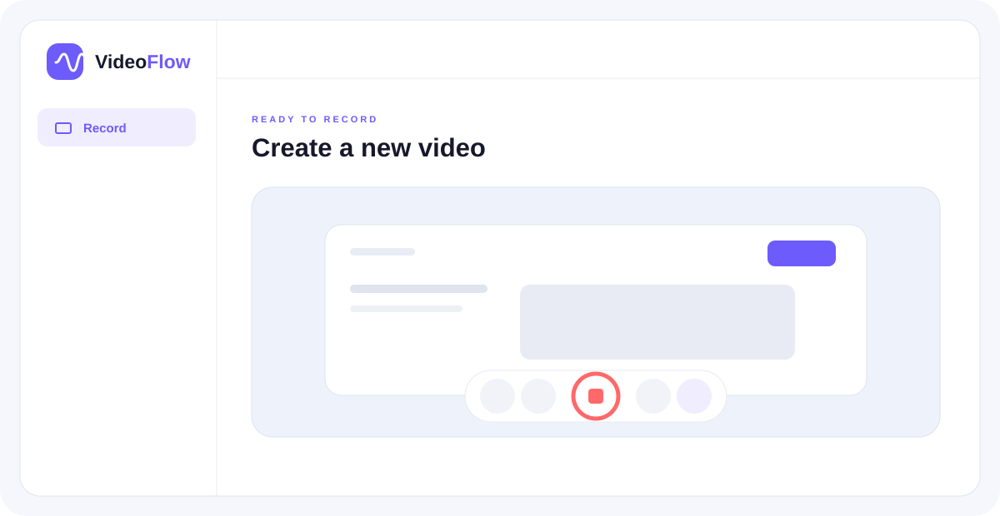

# VideoFlow

VideoFlow 2.5 is a buyer-deployed workspace for recording, editing, reviewing, and publishing video. Each installation runs under the buyer's accounts and brand: Clerk handles sign-in, Convex stores application data, and Cloudflare R2 stores media.



Start locally without provider accounts using [test mode](#try-it-without-any-accounts), follow the [complete setup guide](docs/SETUP.md) for a connected installation, or read the [v2.5 release notes](CHANGELOG.md#250--july-27-2026).

## What is new in v2.5

- Send controlled no-login review requests with approve/request-changes decisions, reminders, and cancellation.
- Turn transcript moments, comments, and reviewer feedback into owner-approved tasks with linked resolution state.
- Publish current finished renditions through direct YouTube/LinkedIn workers or the optional Zernio adapter.
- Record or import, review, edit with draft autosave, and export in the native iOS 17 SwiftUI app.
- Use the Android Compose client with optional Clerk/Convex account connectivity, native capture/import, authenticated R2 upload, draft autosave, and Media3 MP4 export.

## What buyers get

- Screen + microphone, screen + camera bubble, and camera-only recording
- Pause/resume, draggable camera bubble, automatic frame thumbnails, custom thumbnail uploads, generated branded title cards, and capability-selected MP4/WebM output
- A shared non-destructive editor with trim handles, draggable cuts, crop, timed text, click-to-zoom effects, screen framing, master audio/fades, shapes, callouts, uploaded raster graphics, manual click/key overlays, transcript seeking, keyboard shortcuts, canvas zoom, and undo/redo
- Independently movable, scalable, shaped, mirrored, or hidden webcam layers for new screen-and-camera recordings
- A private personal library for every authenticated user
- Folders, tags, favorites, archive, bulk organization, and search across titles, descriptions, transcripts, and captions
- Multiple purpose-specific share links with expiration, view limits, email/domain gates, passwords, embed controls, permissions, custom presentation, and rotation/revocation
- No-login review requests with assigned reviewers, approve/request-changes decisions, optional due dates and instructions, and optional Resend delivery
- Owner-approved task proposals extracted from transcripts, timestamped comments, and reviewer change requests, with OpenAI as an optional enhancement
- Editable SRT/VTT captions with minimal, karaoke, pop, and lower-third presentation plus optional export burn-in
- V2 AI Director with previewable, selectable, undoable edit plans; transcript metadata/chapters; Smart Focus; and branded templates
- Visual SOP/tutorial generation with real timestamped frame captures, plus askable viewer answers grounded in clickable transcript citations
- Interactive chapters, hotspots, CTAs, and polls
- Durable background publishing with progress, retry, cancellation, revision safety, and buyer-deployed MP4 rendering
- Owner-bound direct YouTube/LinkedIn workers plus an opt-in Zernio unified-provider worker, all keeping provider credentials outside the browser and Convex database
- A native iOS 17 SwiftUI client for sign-in, library playback, camera/Photos upload, review requests and reminders, local editor draft recovery, AVFoundation MP4 export, and system sharing
- A native Android Jetpack Compose client with optional Clerk/Convex account data, camera/import upload, local editor draft recovery, Media3 composition editing, MP4 export, and a credential-free preview fallback
- Resumable multipart R2 uploads for large recordings
- Comments, reactions, timestamp navigation, viewer progress, and completion analytics
- Optional transcription through OpenAI or OpenRouter
- Optional first-view and comment notifications through Resend
- Centralized product name, logo, accent, URL, email branding, storage keys, and limits

Desktop Chrome and Edge remain the broadest screen-capture targets. Current Safari is supported for camera/microphone recording, MP4 upload, playback, share/review pages, and edited export when its `MediaRecorder` and canvas-capture capabilities are available; desktop Safari screen capture remains version- and device-dependent. VideoFlow capability-detects containers instead of sniffing the browser, preserves Safari's H.264/AAC MP4 output end to end, and falls back to camera-only setup when display capture is unavailable. Playback and public share pages work in current Chrome, Edge, Firefox, and Safari. Recording requires HTTPS outside `localhost`.

## Fastest setup

You need Node.js 20.19+, 22.13+, or 24+ and free accounts with [Clerk](https://dashboard.clerk.com), [Convex](https://dashboard.convex.dev), and [Cloudflare](https://dash.cloudflare.com). OpenAI/OpenRouter and Resend are optional. This repository pins Node 22.23.1 through `.nvmrc` and `.node-version`, with npm 10.9.8 recorded in `package.json`.

```bash
npm install
npm run setup
npm run doctor
npm run dev
```

The guided setup is the recommended path. It:

1. Collects the brand, URL, recording limit, and upload limit.
2. Opens the official Convex CLI so the buyer can create or select a project.
3. Collects Clerk keys and the Clerk JWT issuer.
4. Collects Cloudflare R2 credentials and configures server-side Convex values.
5. Offers OpenAI, OpenRouter, or no transcription.
6. Optionally configures Resend.
7. Deploys the Convex schema/functions and configures R2 CORS.
8. Prints a secret-free summary and the exact next commands.

### Customization-safe updates

An installed copy is customer-owned. Do not copy a newer VideoFlow folder over it or treat setup as a source-code updater. Bring updates in as reviewable Git commits/patches so local branding, behavior, integrations, and assets can be preserved deliberately.

The setup wizard now patches only the environment keys selected by the user and preserves unmanaged `.env.local` values, comments, spacing, and ordering. The mobile camera selector, library deletion shortcuts, review-request creation, automatic task controls, and social publishing controls are independent feature switches available under `npm run config` → **Optional feature additions**.

Agents are instructed through the root `AGENTS.md` to read the **[customization and upgrade contract](docs/CUSTOMIZATION_UPGRADES.md)** plus an ignored `CUSTOMIZATIONS.local.md` manifest when an installation provides one.

See [CHANGELOG.md](CHANGELOG.md) for versioned release notes.

## Try it without any accounts

Buyers can test the interface and real browser recording before creating Clerk, Convex, Cloudflare, or AI accounts:

```bash
npm install
npm run test-mode
npm run dev
```

Open `http://localhost:3000/test`. Test mode supports screen, camera, microphone, pause/resume, local review, local save, the same full-page editor used by connected installations, trim/cuts, audio fades, shapes, callouts, imported graphics, manual click/key overlays, a persistent browser library, playback, deletion, local share links, password-lock previews, timestamped comments and reactions with click-to-seek navigation, owner exports, permitted viewer downloads, unique viewers, watch progress, and completion analytics. The prominent **Explore guided V2 sample** action creates a synthetic local video without requesting device permissions and walks through Magic Polish, captions, Smart Focus, templates, interactive video, background-publish simulation, and video-to-document. The simulation is explicitly local; no worker or server receives demo media. Choosing **Save & open editor** saves a real recording and navigates directly to the full-page editor. Videos, graphic assets, edit manifests, finished renditions, and engagement are stored in that browser profile's IndexedDB and are never uploaded.

Editor changes are applied non-destructively to VideoFlow playback and public/local share pages. Owners can download an edited MP4 or WebM at the captured source resolution, 1080p, or 720p; the original composite with mixed audio; separate screen and webcam video-only layers when those sources were recorded; or a portable VideoFlow project JSON. Filenames and project manifests preserve the actual browser-selected container. Native export has a 7680×4320 encoder-safety ceiling, but that ceiling is not a promise that every browser, GPU, or device can complete an 8K export.

Edited browser export uses the first compatible encoder advertised by the browser—WebM on Chromium-family browsers and MP4 where Safari exposes only its native H.264/AAC path. Connected V2 installations may also queue a durable native, 1080p, or 720p background job and close the editor; the optional buyer-deployed worker publishes MP4 with progress, retry, cancellation, and exact-revision validation. Public playback prefers the current flattened rendition. A rendering-affecting edit invalidates that revision until a new foreground or background publication completes. Browser exports still depend on available RAM/GPU/encoder support, and the original composite remains the reliable mixed-audio download if Web Audio cannot expose audio for a browser render. See [Rendering and background publishing](docs/RENDERING.md).

The viewer download interface exposes only a finished edited export when the owner enables downloads. When a finished rendition exists for the current editor revision, public playback prefers that flattened file. When it is missing, stale, or unavailable, browser-first live composition can fall back to the original composite and, when present, separate screen and webcam sources. Anyone who can use that fallback can inspect its expiring signed source URLs while they remain valid. The cached-rendition path reduces source exposure and repeated live composition; it is not source-file DRM while a raw-source fallback exists. Read [Architecture and data flow](docs/ARCHITECTURE.md) before making privacy or source-protection promises.

### Editor keyboard shortcuts

Shortcuts work across the full editor and pause automatically while the user is typing in a field or using a dialog.

| Action | Shortcut |
| --- | --- |
| Play or pause | `Space` or `K` |
| Seek one second | `Left Arrow` / `Right Arrow` |
| Seek five seconds | `Shift` + `Left Arrow` / `Right Arrow` |
| Undo / redo | `Cmd/Ctrl + Z` / `Cmd/Ctrl + Shift + Z` |
| Save immediately | `Cmd/Ctrl + S` |
| Delete the selected timed edit or overlay | `Delete` or `Backspace` |
| Select / Cut / Text / Crop | `V` / `C` / `T` / `R` |
| Zoom / Screen / Webcam | `Z` / `S` / `W` |
| Audio / Objects / Clicks & keys | `A` / `O` / `I` |
| Transcript / Settings | `P` / `G` |
| Zoom the editor canvas | `Cmd/Ctrl + Plus` / `Cmd/Ctrl + Minus` |
| Fit the canvas | `Cmd/Ctrl + 0` |
| Open the shortcut reference | `?` |

Canvas view zoom is an editor-only viewing aid. It never changes the source resolution, project edits, share page, or exported video.

Local share links intentionally work only in the browser profile that created them; they simulate the complete viewer workflow without pretending to be cross-device public URLs. IndexedDB is browser-managed, quota-limited storage—not a backup. Clearing site data, changing origin or browser profile, private-browsing cleanup, storage pressure, or browser eviction can remove local recordings. Test mode does not simulate real authentication, Cloudflare delivery, AI transcription, Resend email, or server authorization. Those features become active after full provider setup. Switching to connected mode never uploads existing local test recordings.

Run `npm run setup` at any time and choose **Local test mode**, **Full provider setup**, or **Edit saved configuration**.

Secret prompts are hidden. Browser-safe values are written to the ignored, owner-readable `.env.local`; Cloudflare, transcription, and email secrets are sent directly to the linked Convex deployment. The wizard never prints secrets or copies values from another project.

For screenshots and click-by-click account creation, read the **[complete setup guide](docs/SETUP.md)**.

Selling through an existing landing page? The separate **[browser-only sales demo deployment guide](docs/SALES_DEMO.md)** covers the verified email-code gate, fixed 72-hour access, local-only media, Convex lead tags, Resend delivery, purchase bar, and Vercel configuration. It does not change the buyer-facing `/test` sandbox.

## Provider checklist

| Provider | Required | Purpose | Where to start |
| --- | --- | --- | --- |
| Clerk | Yes | Sign-in and verified user identity | [Create an application](https://dashboard.clerk.com) |
| Convex | Yes | Database, backend functions, schedules | [Create a project](https://dashboard.convex.dev) |
| Cloudflare R2 | Yes | Videos, audio tracks, thumbnails | [R2 getting started](https://developers.cloudflare.com/r2/get-started/) |
| OpenAI | No | Timestamped `whisper-1` transcripts | [Create an API key](https://platform.openai.com/api-keys) |
| OpenRouter | No | Unified speech-to-text model access | [Create an API key](https://openrouter.ai/settings/keys) |
| Resend | No | First-view and comment emails | [Create an account](https://resend.com/signup) |
| Zernio | No | Opt-in unified social publishing | [Read the API documentation](https://docs.zernio.com/) |
| Vercel | No | Recommended Next.js hosting | [Import a project](https://vercel.com/new) |

## Commands

| Command | What it does |
| --- | --- |
| `npm run setup` | Runs the interactive provider and branding wizard |
| `npm run test-mode` | Enables the no-account local recording sandbox immediately |
| `npm run config` | Opens the saved configuration manager to edit one section |
| `npm run doctor` | Checks Node, local variables, Convex server variables, and optional integration pairs without printing values |
| `npm run demo:doctor` | Checks the separate sales-demo Vercel/Convex configuration and compares the shared ingest token without printing secrets |
| `npm run r2:cors` | Applies CORS for `APP_URL` and `http://localhost:3000` to the configured R2 bucket |
| `npm run worker` | Starts one optional background media-worker process |
| `npm run worker:social` | Starts one owner-bound YouTube, LinkedIn, or Zernio publishing worker |
| `npm run dev` | Runs Next.js only in test mode, or Next.js and Convex together in connected mode |
| `npm run build` | Creates a production Next.js build |
| `npx convex deploy` | Deploys the production Convex backend |

## Environment model

The wizard owns these browser/Next.js values in `.env.local`:

| Variable | Example | Notes |
| --- | --- | --- |
| `NEXT_PUBLIC_CONVEX_URL` | `https://example.convex.cloud` | Convex deployment URL |
| `NEXT_PUBLIC_CLERK_PUBLISHABLE_KEY` | `pk_test_…` | Safe for browser use |
| `CLERK_SECRET_KEY` | `sk_test_…` | Used only by Next.js/Clerk |
| `NEXT_PUBLIC_APP_URL` | `http://localhost:3000` | Exact origin, no trailing slash |
| `NEXT_PUBLIC_APP_NAME` | `VideoFlow` | Default visible brand |
| `NEXT_PUBLIC_APP_LOGO_URL` | `/logo.svg` | Local path or hosted image |
| `NEXT_PUBLIC_BRAND_COLOR` | `#6d5bfc` | Six-digit hex |
| `NEXT_PUBLIC_MAX_RECORDING_MINUTES` | `15` | Recorder auto-stop |
| `NEXT_PUBLIC_MAX_VIDEO_BYTES` | `524288000` | Primary-video guardrail; connected mode also validates screen, webcam, and finished-rendition video objects separately |
| `NEXT_PUBLIC_FEATURE_MOBILE_CAMERA_SWITCH` | `true` | Set `false` to keep front-camera-only recorder choices |
| `NEXT_PUBLIC_FEATURE_LIBRARY_DELETE` | `true` | Set `false` to hide library quick-preview and multi-select deletion |
| `NEXT_PUBLIC_FEATURE_REVIEW_REQUESTS` | `true` | Set `false` to hide new no-login review-request creation; existing review links remain usable |
| `NEXT_PUBLIC_FEATURE_AUTOMATIC_TASKS` | `true` | Set `false` to hide task analysis, proposals, and internal task controls |
| `NEXT_PUBLIC_FEATURE_SOCIAL_PUBLISHING` | `true` | Set `false` to hide social destination and publishing controls; existing jobs remain readable by the backend |
| `NEXT_PUBLIC_FEATURE_ZERNIO` | `false` | Set `true` to offer Zernio as an additional unified social-provider choice inside social publishing |

`NEXT_PUBLIC_TEST_MODE=true` bypasses every provider and opens the local sandbox. The configuration manager switches it back to `false` when the buyer is ready for connected mode.

These values belong in the Convex deployment, not `.env.local`:

- Required: `CLERK_JWT_ISSUER_DOMAIN`, `R2_TOKEN`, `R2_ACCESS_KEY_ID`, `R2_SECRET_ACCESS_KEY`, `R2_ENDPOINT`, `R2_BUCKET`, `APP_URL`, `APP_NAME`, `BRAND_COLOR`, `MAX_VIDEO_BYTES`
- OpenAI: `TRANSCRIPTION_PROVIDER=openai`, `OPENAI_API_KEY`, `OPENAI_TRANSCRIPTION_MODEL=whisper-1`
- OpenRouter: `TRANSCRIPTION_PROVIDER=openrouter`, `OPENROUTER_API_KEY`, `OPENROUTER_TRANSCRIPTION_MODEL=openai/whisper-large-v3`
- Resend: `RESEND_API_KEY` and `NOTIFICATION_FROM_EMAIL`
- Optional background worker: `MEDIA_WORKER_SECRET`; give the worker process the same secret plus `VIDEOFLOW_APP_URL` and `NEXT_PUBLIC_CONVEX_URL`
- Optional document/metadata model: `OPENAI_DOCUMENT_MODEL` (defaults to `gpt-4.1-mini` when `OPENAI_API_KEY` exists)

### Social publishing workers

Social publishing is deliberately isolated from browser and Convex credentials. Create a destination in the video editor, copy its one-time connection ID and binding secret, then run one worker process for that destination with:

- `NEXT_PUBLIC_CONVEX_URL`
- `MEDIA_WORKER_SECRET` (the same server-side media-worker value configured in Convex)
- `SOCIAL_CONNECTION_ID`
- `SOCIAL_CONNECTION_SECRET`
- `SOCIAL_PROVIDER_ACCESS_TOKEN`
- LinkedIn only: `LINKEDIN_VERSION` in `YYYYMM` form; the account URN comes from the connection, or may be supplied as `LINKEDIN_OWNER_URN`
- Zernio only: use `ZERNIO_API_KEY` instead of `SOCIAL_PROVIDER_ACCESS_TOKEN`; create one connection per Zernio account/platform target using the account ID from Zernio's [`GET /v1/accounts`](https://docs.zernio.com/accounts/list-accounts)

Run it with `npm run worker:social`. Credentials stay only in the worker environment. The adapters support direct YouTube resumable uploads, direct LinkedIn Videos + Posts, and—when `NEXT_PUBLIC_FEATURE_ZERNIO=true`—Zernio's [presigned media upload](https://docs.zernio.com/media/get-media-presigned-url) plus [immediate unified posting](https://docs.zernio.com/posts/create-post). VideoFlow does not proxy or store Zernio keys.

The native SwiftUI client lives in [`ios/`](ios/README.md). The native Jetpack Compose client lives in [`android/`](android/README.md). Local platform configuration stays ignored, and no server secrets are copied into Xcode, Gradle, or either app bundle.

See [.env.example](.env.example) for placeholder-only examples. Never put real credentials in `.env.example` or commit `.env.local`.

## How the app handles data

| Data | Service | Access model |
| --- | --- | --- |
| User identity/session | Clerk | Clerk session tokens; Convex verifies the configured issuer |
| Video metadata and engagement | Convex | Every private function derives the owner from verified identity |
| Video/audio/thumbnail/graphic objects | Cloudflare R2 | Direct browser PUT and GET through expiring presigned URLs; pending uploads are ownership-bound and expire |
| Transcript audio | OpenAI or OpenRouter, only when enabled | Microphone-only WebM under 25 MB |
| AI Director, documents, and viewer answers | OpenAI, only when enabled | The relevant transcript text, owner instruction or viewer question; viewer answers are limited to ten questions per viewer/video/hour and 500 per video/day |
| Notification content | Resend, only when enabled | Owner email, title, and safe comment excerpt |
| Guest comment identity | Convex | Guest name and required email are stored with the comment |
| Viewer analytics | Convex | Browser-generated viewer key, watch progress, user agent, and referrer when available |

Public password-protected resources require a short-lived unlocked share session, including before a viewer question can access transcript context. Share passwords are salted and hashed server-side. Viewer questions require an explicit in-page AI processing acknowledgement and are not stored as content by VideoFlow; a pseudonymous rate-limit key is retained in Convex. A presigned media URL is a temporary bearer credential: once issued to an unlocked browser it works until it expires, even if the application session ends first. Link rotation blocks new requests through the old share page but cannot revoke a media URL that was already issued. No analytics SDK is installed, and VideoFlow does not send data to optional providers unless their keys are configured. The mic-only transcription source remains in R2 until its video is deleted.

## Media architecture and operating envelope

The bundled product uses a browser-first media path. Next.js serves the application, Convex handles identity-aware metadata and application functions, and the browser transfers media directly to and from R2. Next.js and Convex do not proxy normal video uploads or playback bytes.

| Profile | Status | Media behavior |
| --- | --- | --- |
| Browser-first live composition | Bundled | Browser records, previews, uploads, and can compose source layers during editing/playback or as a fallback |
| Browser-published WebM | Bundled | Owner's browser renders a finished WebM, stores it by editor revision, and public playback prefers it while current |
| Background render worker | Bundled, optional deployment | Durable Convex jobs drive buyer-deployed Chromium/FFmpeg workers for MP4 or WebM without an open owner tab |

The default 15-minute recording limit and 500 MB setting are guardrails, not a capacity SLA. A published screen-and-camera recording stores six core objects—the composite with mixed audio, raw screen video, raw webcam video, mic-only transcription audio, a thumbnail, and the current finished WebM rendition—plus each imported editor graphic (up to 50 per video, raster-only, 10 MB each). The composite, screen, webcam, and finished video objects are validated separately against the configured video limit, so total storage can be several times the displayed recording size. Recording, exporting, and publishing also hold multiple encoded streams or output chunks in browser memory.

Before selling an installation, test a realistic maximum-length screen-and-camera recording, export, and publication on the hardware, browser, network, and resolution that buyers will use. The short acceptance recording confirms configuration; it does not establish production capacity. See:

- [Architecture and data flow](docs/ARCHITECTURE.md)
- [Rendering and background publishing](docs/RENDERING.md)
- [Operations, capacity, backups, and incidents](docs/OPERATIONS.md)

## Transcription choices

- **OpenAI** uses `whisper-1` verbose JSON so transcript rows retain timestamped segments. Audio at or above 25 MB is skipped cleanly.
- **OpenRouter** uses its dedicated `/api/v1/audio/transcriptions` endpoint. Its normalized response provides a searchable full transcript stored as one timeline segment.
- **None** leaves recording, playback, comments, reactions, downloads, and sharing fully functional.

Change providers later by rerunning `npm run setup` or updating the Convex values manually. New recordings use the active provider; existing transcripts remain stored in Convex.

## Rebranding

Run `npm run setup` again to update the product name, accent, app URL, and limits. Replace `public/logo.svg` for a custom mark. The wizard mirrors name, URL, and color into Convex so public pages and notification emails use the same identity.

White-label values are centralized in `lib/config.ts`; visible copy uses the configured name. Search the repository for the default `VideoFlow` only if you want to change code/documentation defaults too.

## Production deployment

1. Create separate production Clerk, Convex, and R2 resources. Do not reuse development credentials.
2. Run `npx convex deploy` and choose the production deployment.
3. Add every browser/Next.js variable listed above to Vercel or your hosting provider.
4. Set server variables on the production Convex deployment (`npx convex env set --prod NAME VALUE`, when applicable to your CLI version).
5. Deploy Next.js, set `APP_URL` and `NEXT_PUBLIC_APP_URL` to the final HTTPS origin, then run `npm run r2:cors` against production.
6. Run `npm run doctor`, make a test recording, open its share link signed out, test password unlock, then delete the recording.

Read **[production deployment](docs/DEPLOYMENT.md)** before handing an installation to customers.

## Quality checks

```bash
npm ci
npm run lint
npm run typecheck
npm test
npm run build
npm run test:e2e
npm run test:e2e:demo
npm audit --omit=dev
```

## Troubleshooting

- **Convex reports unauthenticated:** Clerk's issuer must belong to the same Clerk instance as the publishable key. Recheck the Clerk Convex integration and rerun `npx convex dev --once`.
- **Upload fails or the browser reports CORS:** `APP_URL` must be the exact browser origin. Rerun `npm run r2:cors` whenever the domain changes.
- **Screen sharing is unavailable:** use desktop Chrome/Edge over HTTPS or `localhost`. A LAN IP over plain HTTP is not a secure browser context.
- **No transcript appears:** confirm a provider and its matching key in `npm run doctor`. Recordings need microphone audio and the extracted audio must remain below 25 MB.
- **No email arrives:** both Resend values are required, and the sender address must use a verified domain.
- **Node warning during install:** use a supported LTS release. Run `node --version`; Node 21 and 23 are intentionally outside the supported range.
- **Setup was interrupted:** rerun `npm run setup`. Existing local values are retained when you press Enter.
- **I only want to change one key:** run `npm run config`, select Clerk/Convex, R2, transcription, Resend, branding, or runtime mode, then save and exit.
- **Local test videos or links disappeared:** IndexedDB belongs to one browser profile and origin. Clearing site data, using a different port/domain, or using private browsing creates a different local library. A copied local link cannot open on another device.

## Scope

This repository is buyer-deployed source code, not a centrally hosted multi-tenant SaaS. Clerk, Convex, R2, worker capacity, and optional providers remain in the buyer's accounts. V2.5 includes resumable multipart ingest, a durable render queue, MP4 worker delivery, connected native iOS and Android clients, and credential-free native preview fallbacks. Store signing/distribution, background-resumable native uploads, push notifications, billing, license enforcement, shared team libraries, CRM integrations, browser extensions, HLS/adaptive streaming, and a media CDN gateway remain outside this release.
