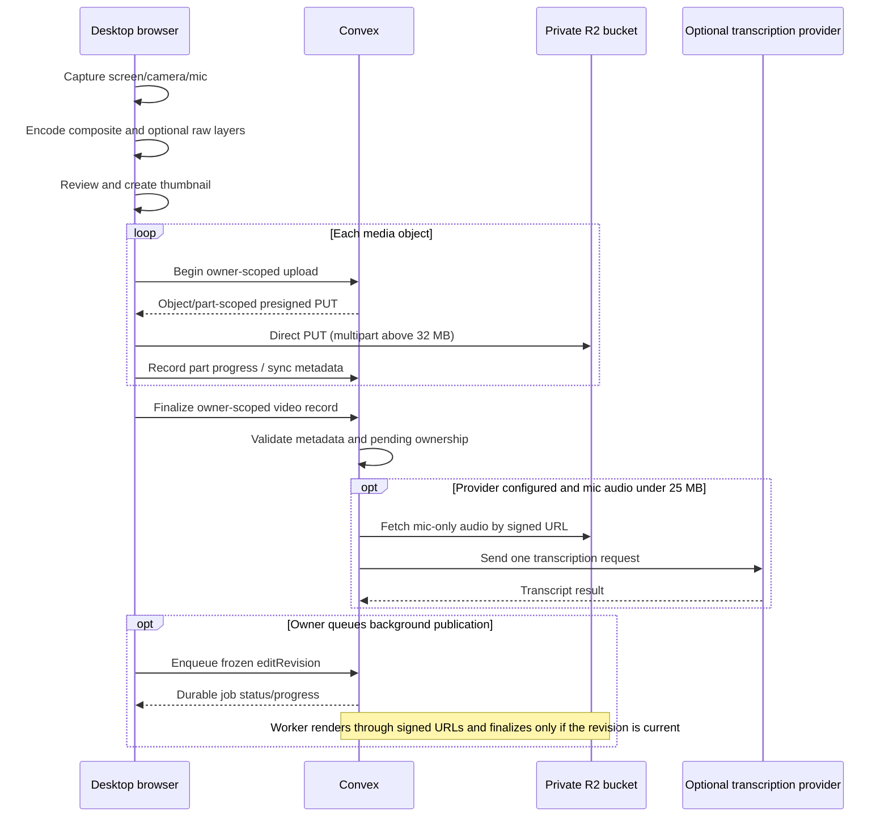

# Architecture and data flow

This document describes the V2 media architecture bundled in this repository. The background worker code ships with the product, while deploying worker capacity remains optional; see [Rendering and background publishing](RENDERING.md).

## Deployment model

VideoFlow is buyer-deployed source code backed by managed services in the buyer's accounts. It is not a fully on-premises stack:

| Component | Current responsibility | Handles normal video bytes? |
| --- | --- | --- |
| Next.js host | Serves the React application, metadata, and Clerk route protection | No; it does not proxy normal upload, playback, or export traffic |
| Browser | Captures devices, encodes WebM, previews, creates thumbnails, uploads, composes edits, and can publish a foreground WebM | Yes |
| Clerk | User sign-in and session issuance | No |
| Convex | Verified identity, organization, captions, interactions, share sessions, durable media jobs, analytics, signed-R2 coordination, schedules, and optional integration actions | Only optional provider fetches; normal media stays direct-to-R2 |
| Cloudflare R2 | Private sources, thumbnails, mic audio, editor graphics, staged output, and finished renditions | Yes |
| Optional media worker | Claims leased jobs, opens the shared compositor in headless Chromium, and converts staged WebM to H.264/AAC MP4 with FFmpeg | Yes, through signed R2 URLs |
| OpenAI or OpenRouter | Optional speech-to-text | Mic-only audio below the configured v1 provider limit |
| Resend | Optional first-view and comment notifications | No video; receives notification fields only |

Next.js does not proxy upload, playback, or render bytes. V2 includes a Dockerized worker and MP4 conversion, but not HLS/ABR packaging or an authenticated media gateway.

## Connected recording flow



The browser uploads the composite, mic audio when present, raw screen/webcam layers, and thumbnail. Objects below 32 MB use the existing signed PUT. Larger objects use 8 MB multipart uploads with three concurrent parts, per-part retry, server-recorded progress, and same-file resume for 24 hours. Configure an R2 lifecycle rule to abort incomplete multipart uploads after one day.

The finalize action does not trust browser-reported ownership or object metadata. Convex derives the owner from the authenticated identity, verifies pending-upload ownership, syncs R2 metadata, validates content type and size, creates the video record, and removes the claimed pending rows.

Relevant source:

- [`components/videos/use-media-recorder.ts`](../components/videos/use-media-recorder.ts)
- [`components/videos/video-recorder.tsx`](../components/videos/video-recorder.tsx)
- [`convex/r2.ts`](../convex/r2.ts)
- [`convex/videoActions.ts`](../convex/videoActions.ts)
- [`convex/videos.ts`](../convex/videos.ts)
- [`convex/cleanup.ts`](../convex/cleanup.ts)

## What the browser records

All modes create a primary WebM containing the visible recording and mixed audio. Screen-and-camera mode can also retain independent visual layers for later editing:

| Object | Content | Purpose |
| --- | --- | --- |
| Composite video | Visible recording plus mixed mic/system audio | Audio source, backward-compatible playback, original download, and fallback |
| Screen video | Raw screen, video only | Non-destructive crop, scale, positioning, and zoom |
| Webcam video | Raw webcam, video only | Independent webcam placement, size, shape, mirror, visibility, and stroke |
| Mic audio | Microphone only | Optional transcription |
| Thumbnail | Captured frame, uploaded art, or generated title card | Library and public poster |
| Finished rendition | Flattened WebM for one exact editor revision | Preferred public playback and reusable published result |
| Editor graphic | Owner-uploaded PNG, JPEG, or WebP | Timed image overlays; only referenced assets are exposed to live public composition |

For screen-and-camera mode the primary composite canvas is capped at 1920 pixels wide to protect real-time browser compositing. The raw screen recorder can retain the browser-provided native capture dimensions, and the raw webcam requests up to 1080p. All recorder chunks remain in browser memory until stop; duration repair and playable-layer checks also happen before save.

If either independent visual layer is missing or unplayable, both are omitted and the known-good composite remains available. Older or fallback recordings can still use cuts, crop, text, screen framing, and zoom, but a webcam already baked into the composite cannot be independently moved.

## Local test mode

Test mode uses the same recorder, player, editor, timeline, thumbnail, and export components. It replaces Clerk, Convex, and R2 with browser IndexedDB for video blobs, graphic assets, edit state, viewer settings, comments, reactions, finished renditions, and analytics.

Choosing **Save & open editor** writes the recording to IndexedDB and navigates directly to `/test/videos/[id]`. The editor's **Settings** tool owns title, description, thumbnail, local share link, permissions, password preview, CTA, activity, analytics, and deletion. The library quick-preview panel is optional.

Test mode also stores a browser-rendered finished WebM in IndexedDB when the owner chooses **Publish latest**. The blob records the `editRevision` that produced it. A rendering-affecting edit advances the revision and clears or invalidates the old rendition; **Update published video** creates a new current one.

The guided V2 sample is generated at runtime from a synthetic canvas recording, so no customer recording is committed or uploaded. Its background-publish step is a clearly labeled local simulation; the connected product uses the real durable worker queue.

IndexedDB is scoped to an origin and browser profile. It is quota-limited and can be cleared or evicted by the browser. Test-mode recordings are evaluation data, not backups, and are never migrated automatically into connected mode.

Relevant source:

- [`components/test-mode/local-recorder.tsx`](../components/test-mode/local-recorder.tsx)
- [`components/test-mode/local-video-editor.tsx`](../components/test-mode/local-video-editor.tsx)
- [`lib/local-video-store.ts`](../lib/local-video-store.ts)

## Editor and save model

Edits are non-destructive manifests stored separately from source objects. The manifest contains source-time trim/cuts, crop, screen and webcam transforms, timed text, zoom effects, master gain/fades, shapes/callouts/images, and manual click/key overlays. Caption tracks, interactive elements, organization, templates, documents, share links, and media jobs are separate owner-scoped records. Rendering-affecting changes advance `editRevision` and invalidate an older rendition. Foreground and background publication both bind to the revision that began them, so a slow render cannot replace newer edits.

The player keeps the composite as the primary timeline and audio source. When both independent visual layers are ready, the primary visual is hidden while the raw screen and webcam are synchronized to it. Trim/cuts skip source-time ranges, Web Audio applies the saved master/fade envelope, and CSS/React overlays apply layout, crop, zoom, text, shapes, graphics, clicks, and key badges in real time.

This provides immediate editing without a render queue. Before a current rendition is published, a screen-and-camera viewer can decode three video sources simultaneously: hidden composite/audio, raw screen, and raw webcam. After a current finished rendition is available, public playback prefers that one flattened source.

Relevant source:

- [`components/videos/video-editor-workspace.tsx`](../components/videos/video-editor-workspace.tsx)
- [`components/videos/player/video-player.tsx`](../components/videos/player/video-player.tsx)
- [`lib/video-edits.ts`](../lib/video-edits.ts)
- [`convex/lib/finishedRendition.ts`](../convex/lib/finishedRendition.ts)

## Public playback and signed sources

Convex returns public metadata only for a public share token. Password-protected videos require a valid, non-expired unlock session before Convex returns transcript, engagement, or media URLs.

R2 media URLs are presigned bearer credentials. The signature authorizes the exact object operation until the URL expires; anyone holding the URL can use it during that window.

Public media selection is revision-aware:

1. If a ready finished rendition matches the current `editRevision`, the public query returns that rendition URL, omits raw composite/screen/webcam URLs and live edit overlays, and uses the finished duration for public playback and engagement clamps.
2. If no current rendition exists—for example a legacy, unpublished, newly edited, failed, or removed rendition—the public page can use live source composition as a fallback. That path receives the composite and any raw visual-layer URLs required to reproduce the edits.

The viewer download interface hides original/source download choices. A current published rendition materially reduces raw-source exposure and repeated rendering, but the live-composition fallback remains a source-delivery path.

Consequences:

- Do not describe the complete browser-first profile as raw-source DRM while the legacy/unpublished source fallback remains enabled.
- Making a video private, rotating its share link, or expiring an application unlock session blocks new application requests but does not revoke an R2 URL already issued.
- Keep the R2 bucket private and treat URL lifetime as part of the security model.
- Verify public queries omit raw source URLs whenever a current rendition exists; this is a security regression gate.
- The background-worker profile produces MP4/WebM without an open owner tab. HLS remains outside the shipped V2 delivery profile.

See Cloudflare's [presigned URL documentation](https://developers.cloudflare.com/r2/api/s3/presigned-urls/) for the bearer-token and expiry model.

Relevant source:

- [`convex/videosPublic.ts`](../convex/videosPublic.ts)
- [`convex/videoPasswords.ts`](../convex/videoPasswords.ts)
- [`app/v/[token]/page.tsx`](../app/v/[token]/page.tsx)

## No-login review requests

A review request owns a dedicated controlled share link and a separate `videoReviewRequests` record. The request record stores the assigned reviewer, optional instructions and due date, and one pending/approved/changes-requested state. Public responses never accept an owner ID or video ID from the browser: Convex resolves both from the unguessable share token, confirms the link is active, and validates a non-expired share session whenever the link has an email gate or password.

Reviewer email addresses remain owner-only and are omitted from public video responses. Public response writes are rate-limited and store bounded plain-text names and notes. Resend delivery is optional; missing email configuration skips invitation and decision notifications without changing the request or review flow.

Relevant source:

- [`components/videos/video-share-links-panel.tsx`](../components/videos/video-share-links-panel.tsx)
- [`convex/videoFlowV2.ts`](../convex/videoFlowV2.ts)
- [`convex/videosPublic.ts`](../convex/videosPublic.ts)

## Video tasks

Task analysis reads only an authenticated owner's video transcript, comments, and reviewer change requests. Deterministic extraction always remains available; when `OPENAI_API_KEY` exists, the optional document model may return bounded structured candidates. Both paths write private proposals first. A separate owner mutation accepts a proposal and idempotently creates the internal task, so analysis never causes an external task side effect.

Relevant source:

- [`lib/video-v2.ts`](../lib/video-v2.ts)
- [`convex/videoFlowV2Actions.ts`](../convex/videoFlowV2Actions.ts)
- [`convex/videoFlowV2.ts`](../convex/videoFlowV2.ts)

## Social publishing

Convex stores owner-scoped destination metadata and a hash of a random worker-binding secret, not provider access tokens. One separately deployed worker binds to one connection and receives its YouTube or LinkedIn token through the worker environment. An owner can enqueue only the current exact-revision MP4. The worker authenticates with both the installation media secret and connection binding, receives a short-lived signed rendition URL, then reports progress and the provider result to a leased, retryable job.

The bundled worker adapters use YouTube's resumable upload protocol and LinkedIn's Videos and Posts APIs. An independently switched Zernio adapter requests a Zernio presigned media upload, transfers the exact current MP4, and submits one immediate post for a configured Zernio account/platform with a stable provider request ID. Its API key also stays only in the worker environment. End-user OAuth consent, refresh-token hosting, and automatic reconciliation after an unknown provider outcome are outside the direct-provider slice; Zernio may own those provider connections when that adapter is selected.

Relevant source:

- [`components/videos/video-social-publishing.tsx`](../components/videos/video-social-publishing.tsx)
- [`worker/social-publish-worker.mjs`](../worker/social-publish-worker.mjs)
- [`convex/videoFlowV2.ts`](../convex/videoFlowV2.ts)

## Native iOS client

The iOS 17 SwiftUI app uses Clerk's Convex auth bridge and the same owner-scoped Convex functions as the web app. It subscribes directly to private library and review data, plays short-lived signed media, and uploads camera captures directly to an authenticated R2 presigned URL before calling the server-verified video create action. No R2, Clerk secret, media-worker, or provider token is embedded in the app.

Relevant source:

- [`ios/README.md`](../ios/README.md)
- [`ios/VideoFlow/Services/VideoFlowService.swift`](../ios/VideoFlow/Services/VideoFlowService.swift)
- [`convex/videoActions.ts`](../convex/videoActions.ts)

## Native Android client

The Android app uses Jetpack Compose for native navigation and interaction. Its edit project stores ordered source ranges, speed, gain, canvas, and text-layer state. That state creates one Media3 `Composition`: `CompositionPlayer` previews it and `Transformer` renders the same composition to an H.264/AAC MP4, avoiding separate preview-only behavior. The preview service is local sample data; production connectivity must use the same verified identity boundary as web and iOS.

Relevant source:

- [`android/README.md`](../android/README.md)
- [`android/app/src/main/java/com/videoflow/android/editor/EditorMediaEngine.kt`](../android/app/src/main/java/com/videoflow/android/editor/EditorMediaEngine.kt)
- [`android/app/src/main/java/com/videoflow/android/editor/VideoEditorScreen.kt`](../android/app/src/main/java/com/videoflow/android/editor/VideoEditorScreen.kt)

## Edited download and publication flow

The bundled renderer runs entirely in desktop Chrome or Edge for both edited downloads and owner publication:

1. Load the composite and any independent visual layers through CORS-readable URLs.
2. Create an output canvas at native, 1080p, or 720p dimensions.
3. Seek and play the kept source-time ranges.
4. Draw screen, webcam, crop, zoom, and timed text for every frame.
5. Route primary audio through Web Audio when the browser permits it.
6. Encode the canvas stream with MediaRecorder.
7. Accumulate every output chunk in memory and repair the WebM duration.
8. For download, save the blob to the owner's device. For publication, upload it to R2 (or save it to IndexedDB in test mode) and finalize it only if its starting `editRevision` is still current.

Native output is capped at 7680×4320 as an encoder safety bound. It is not a guarantee that an 8K render will complete. Long/native renders can exhaust memory or overload the encoder; 1080p is the safer operational default for downloads. Rendering takes roughly the recording's kept duration, must remain in an open active tab, and is not resumable. A published result is cached for public playback until rendering-affecting edits invalidate its revision. Viewer downloads can still perform their own foreground render according to the enabled download flow.

If Web Audio cannot expose the primary audio track, the code preserves a useful silent edited export rather than failing the video render. The original composite remains the reliable mixed-audio source.

Relevant source:

- [`lib/video-export.ts`](../lib/video-export.ts)
- [`components/videos/video-download-menu.tsx`](../components/videos/video-download-menu.tsx)

## Transcription flow

The browser records mic-only audio separately. After video finalization, Convex schedules one Node action when a provider is configured and the object is below 25 MB. That action fetches the complete audio object into memory and makes one provider request.

- OpenAI `whisper-1` requests verbose JSON with segment timestamps.
- OpenRouter stores its normalized response as one searchable whole-video segment.
- Missing provider configuration leaves transcription off without breaking recording or sharing.
- Audio at or above 25 MB is marked too large.
- A failed attempt is marked as an error. The bundled v1 has no retry queue, chunking, or manual retry control.
- The mic-only object remains in R2 until the video is deleted.

Relevant source:

- [`convex/videoTranscription.ts`](../convex/videoTranscription.ts)
- [`convex/videos.ts`](../convex/videos.ts)

## Size and capacity semantics

The default UI guardrails are 15 recording minutes and 500 MB. They are not a tested capacity promise:

- The browser checks the primary composite before upload.
- Connected finalization validates primary, screen, webcam, and finished-rendition video objects separately against the configured server limit.
- The value is not an aggregate recording or per-owner quota.
- Mic audio and thumbnail are additional storage.
- Recording, exporting, and publishing can fail from browser memory, encoder, GPU, device, or network pressure before a byte limit is reached.

For capacity planning, define:

```text
stored bytes per recording = composite + screen + webcam + mic audio + thumbnail + current finished rendition
browser capture pressure    = all active encoders + retained chunks + repaired blobs
public playback pressure    = one current rendition, otherwise composite/audio + screen + webcam fallback
browser export pressure     = decoded sources + output canvas + encoded chunks + repaired output
```

Measure those values using the actual buyer hardware and capture resolution. A 10-second smoke test verifies setup only. Use a representative 5–15 minute screen-and-camera recording for an operating-envelope test.

## Metadata growth limits

The current personal-library and engagement queries collect complete owner/video result sets before sorting or aggregating. Public playback reports watch progress periodically, and each unique viewer creates a row. This is appropriate for an initial personal deployment but needs pagination, retention, and rollups before high-volume use.

The hourly cleanup processes bounded batches of expired sessions, pending uploads, stale rendition attempts, and rate-limit rows. A rendition left `rendering` for more than 24 hours returns to `ready` if a known-good current file still exists; otherwise it becomes a timeout error. Monitor backlog growth; a bounded job that receives work faster than it drains is not a retention policy.

## Evolution path

| Stage | Status | Goal |
| --- | --- | --- |
| Browser-first live composition | Bundled | Direct R2 transfer, immediate non-destructive editing, and a compatibility fallback for legacy/unpublished videos |
| Browser-published rendition | Bundled | Owner foreground render cached by edit revision; public playback prefers one flattened WebM and omits raw source URLs while current |
| Hardened ingest | Bundled V2 | Owner-scoped multipart sessions, per-part retry, same-file resume, and ownership-bound finalization |
| Background render worker | Bundled V2; optional deployment | Buyer-deployed Chromium/FFmpeg worker, durable jobs, and background MP4/WebM derivatives |
| Adaptive delivery | Future | HLS variants, authenticated media gateway/CDN, analytics rollups, and autoscaled workers |

The next stage should preserve the current owner-scoped Convex authorization model and direct-to-R2 byte path while adding aggregate quotas, HLS/ABR, transcription chunking, and analytics rollups.

## Further reading

- Cloudflare [R2 presigned URLs](https://developers.cloudflare.com/r2/api/s3/presigned-urls/)
- Cloudflare [R2 upload options and multipart constraints](https://developers.cloudflare.com/r2/objects/upload-objects/)
- Convex [scheduling overview](https://docs.convex.dev/scheduling/overview)
- Convex [production environment variables](https://docs.convex.dev/production/environment-variables)
- OpenAI [speech-to-text guide](https://developers.openai.com/api/docs/guides/speech-to-text)
- FFmpeg [official documentation](https://ffmpeg.org/documentation.html)
