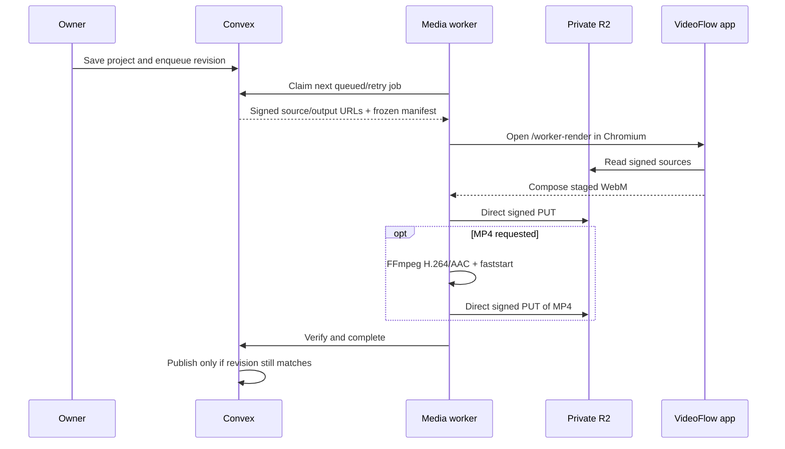

# Rendering and background publishing

VideoFlow V2 ships two publication paths. Owners can create a browser-native MP4 or WebM in the foreground for zero-infrastructure installations. A buyer-deployed media worker can also claim durable jobs, render the exact saved edit revision, and publish MP4 without keeping the editor open.

## Profiles

| Capability | Foreground browser | Background worker |
| --- | --- | --- |
| Included | Yes | Yes; deployment is optional |
| Output | Capability-selected MP4 or WebM | MP4 or WebM |
| Owner tab required | Yes | No after the job is queued |
| Queue/retry/cancel | No | Durable Convex job, lease, progress, three attempts, cancel |
| Revision safety | Finalize only against the starting `editRevision` | Superseded if the video changes before completion |
| Caption burn-in | Render-time overlay | Render-time overlay; the full caption track is supported |
| Media path | Browser ↔ R2 | Worker browser/FFmpeg ↔ R2; Next.js does not proxy media |

Public playback uses a ready rendition only when its revision matches the current editor revision. Otherwise it falls back to live composition of the source media. This makes publication safe against a slow or retried render overwriting newer edits.

## Run the worker

The worker needs the public application URL, Convex deployment URL, and the same random worker secret stored in Convex:

```bash
openssl rand -hex 32
npx convex env set MEDIA_WORKER_SECRET
export VIDEOFLOW_APP_URL=https://video.example.com
export NEXT_PUBLIC_CONVEX_URL=https://example.convex.cloud
export MEDIA_WORKER_SECRET=the-same-secret
npm run worker
```

The application URL must be reachable from the worker. The worker opens `/worker-render` in headless Chromium to reuse the product canvas compositor, uploads a staged WebM directly to R2, and uses FFmpeg for H.264/AAC MP4 conversion.

Docker deployment:

```bash
docker build -f worker/Dockerfile -t videoflow-media-worker .
docker run --rm \
  -e VIDEOFLOW_APP_URL=https://video.example.com \
  -e NEXT_PUBLIC_CONVEX_URL=https://example.convex.cloud \
  -e MEDIA_WORKER_SECRET=the-same-secret \
  videoflow-media-worker
```

Run multiple replicas for additional throughput. Convex leases one job to one worker and requeues expired leases. The current implementation processes one job per worker process at a time.

## Job lifecycle



Statuses are `queued`, `leased`, `processing`, `uploading`, `verifying`, `retry_wait`, `ready`, `failed`, `canceled`, and `superseded`. Worker calls require `MEDIA_WORKER_SECRET`; owner-facing job queries and mutations always derive ownership from `identity.tokenIdentifier`.

## Operational notes

- The worker is optional. If it is absent, recording, editing, foreground MP4/WebM publishing, sharing, comments, and downloads still work.
- OpenAI and Resend are unrelated optional integrations and do not affect the worker.
- R2 must allow CORS from the app origin because the headless browser reads sources and uploads staged output. Run `npm run r2:cors` after changing domains.
- Worker capacity is real-time browser composition plus optional FFmpeg conversion. Benchmark representative 5–15 minute recordings on the intended worker size.
- Set an R2 lifecycle rule to abort incomplete multipart uploads after one day. Convex expires its matching resumable-upload metadata after 24 hours.
- The worker currently creates one finished rendition, not HLS/ABR variants. HLS remains a later delivery stage.
- Treat signed URLs as temporary bearer credentials. Keeping the bucket private and URLs short-lived is part of the security model.

Relevant implementation:

- [`worker/media-worker.mjs`](../worker/media-worker.mjs)
- [`worker/Dockerfile`](../worker/Dockerfile)
- [`app/worker-render/page.tsx`](../app/worker-render/page.tsx)
- [`components/worker-render-client.tsx`](../components/worker-render-client.tsx)
- [`convex/videoFlowV2.ts`](../convex/videoFlowV2.ts)
- [`lib/video-export.ts`](../lib/video-export.ts)
